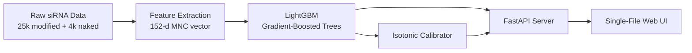

# HelixZero-CMS — Chemical Modification Scanning for siRNA Therapeutics

Predict which chemical modification pattern will silence your target gene best — before you spend money on synthesis. Given an mRNA target, HelixZero-CMS ranks all 1,260 modification variants per siRNA candidate by predicted efficacy (0–100), flags seed-based toxicity, and checks off-target complementarity.

---

## Quick Start

```bash
# Install
pip install -r requirements.txt

# Start the web app
uvicorn api.main:app --reload --port 8000
# → Open http://localhost:8000

# Or use the command line
python cli/run.py rank --sequence AUGGAGGAGCCGCAGUCAGAUCCUAG --top 10
python cli/run.py single-mod --sense GCAGCACGACUUCUUCAAGUU --antisense CUUGAAGAAGUCGUGCUGCUU --top 20
```

On Windows, double-click `start_server.bat`.

---

## What It Solves

Designing an siRNA therapeutic means choosing a modification pattern from **30 modification types × 21 positions × 2 strands = 1,260 variants per siRNA**. Testing even 5 in the lab costs $1,000–$2,500 and takes 2–4 weeks.

**HelixZero-CMS eliminates the guesswork.** It ranks all 1,260 variants computationally using LightGBM:

| Model | Scope | Algorithm | Accuracy |
|-------|-------|-----------|----------|
| **cm-siRNA** | Modified siRNAs (all 1,260 variants) | LightGBM, 152-d features | Within-target PCC **0.68**, MAE **16.4%** |
| **Naked** | Unmodified siRNA baseline ranking | LightGBM, 156-d features | All-source PCC **0.55** |

---

## How It Works

```
mRNA/gene sequence
        │
        ▼
[1] Generate all 21-mer siRNA candidates (sliding window)
        │
        ▼
[2] Extract 152-d feature vector per candidate:
    ├── Mononucleotide composition (base + modified)     140-d
    ├── Position-aware modification density               8-d
    ├── GC content                                        2-d
    └── Assay condition (dose, time)                      2-d
        │
        ▼
[3] LightGBM predicts efficacy (0–100)
        │
        ▼
[4] For your chosen siRNA → generate 1,260 modification variants
        │
        ▼
[5] Rank all variants by predicted efficacy + toxicity flags
```

### Architecture



---

## Model Performance

### cm-siRNA Model (Modification Ranking)

| Metric | Value | What It Measures |
|--------|-------|------------------|
| **PCC** (random 82/18 split) | **0.6789** | Within-siRNA modification ranking accuracy |
| **Spearman** | **0.6736** | Rank-order agreement |
| **MAE** | **16.42%** | Average prediction error (%-points inhibition) |
| **Best single gene** (PCSK9) | **0.8465** | — |
| **Worst single gene** (PLN, n=95) | **0.4553** | Small-data genes are harder |

### Naked siRNA Model (Baseline Ranking)

| Source | n | PCC | Notes |
|--------|---|-----|-------|
| All (source-aware) | 4,060 | **0.5543** | Uses source one-hot encoding |
| Taka (independent) | 699 | **0.6905** | Best generalization — peer-reviewed data |
| Huesken (largest set) | 2,361 | 0.4179 | Public benchmark, known label noise |
| Mix | 462 | 0.4622 | Mixed public data |
| Internal catalog | 538 | 0.0486 | Poor quality — labels may be unreliable |

### Training Data Sources

**Modified siRNAs:** 25,763 unique sequences extracted from the HelixZero patent catalog, spanning 13 target genes, with per-position chemical modification annotations, measured % inhibition, and assay conditions (dose, timepoint).

**Unmodified siRNAs:** 4,060 sequences merged from four published sources:
- **Huesken et al. 2005** — *Nature Biotechnology* (2,361 rows, gold standard)
- **Reynolds/Vickers/Ui-Tei** — Combined design-rule papers (462 rows)
- **Takayuki (Naito) 2007** — *Nucleic Acids Research* (699 rows, cleanest single-condition)
- **HelixZero internal** — In-house measurements (538 rows)

---

## Web UI

A single-file dark-theme web app with four tabs:

| Tab | Purpose |
|-----|---------|
| **Rank** | Paste an mRNA sequence → get ranked siRNA candidates by naked baseline score |
| **Single-Mod** | Scan all 1,260 chemical modifications for one siRNA → ranked by delta over baseline |
| **Multi-Mod** | Beam-search for optimal multi-modification designs (2-mod, 3-mod combinations) |
| **Modifications** | Reference table of all 30 supported chemical modification symbols |

Built-in safety filters:
- **Seed Toxicity** — Safe / Caution / Toxic labels based on Janas et al. 2018 hexamer lookup
- **Modification-Aware Rescue** — If a rescue modification (2'-OMe, 2'-F, LNA, 2'-MOE) sits in the seed region, toxic → Mitigated
- **Functional Checks** — GC content, homopolymer runs, GC-rich runs, internal palindromes

---

## Project Structure

```
├── api/main.py                   FastAPI server (4 endpoints)
├── app.html                      Single-file web UI
├── cli/run.py                    Command-line interface
├── src/
│   ├── features.py               152-d MNC feature extraction
│   ├── predictor.py              Ranking + modification prediction orchestration
│   ├── modification_engine.py    Single-mod scan + multi-mod beam search
│   ├── filters.py                Seed toxicity + functional checks
│   ├── parser.py                 FASTA / inline sequence parsing
│   └── sirna_generator.py        21-mer sliding window generation
├── models/
│   ├── model_a.pkl / b.pkl / c.pkl   cm-siRNA LightGBM (152-d, 799 trees)
│   ├── model_normal.pkl               Naked siRNA LightGBM (156-d, 84 trees)
│   ├── calibrator_cm.pkl / calibrator_naked.pkl   Isotonic calibrators
│   ├── train_gbm_v3.py                 Training script (v3, 152-d, production)
│   └── calibrate.py                   Isotonic calibrator fitting
├── data/
│   ├── hetero_train_2728.csv / hetero_val_303.csv   cm-siRNA data
│   ├── normal_siRNA_extended.csv                    Naked siRNA data (4 sources)
│   └── modification_codes.json                      30 symbol definitions
├── docs/                          Full documentation suite
└── tests/test_pipeline.py         19 unit tests
```

---

## Tech Stack

| Layer | Technology |
|-------|-----------|
| Language | **Python 3.11** |
| ML model | **LightGBM** (gradient-boosted trees) |
| Feature extraction | **NumPy** |
| Data wrangling | **pandas** |
| Evaluation | **scikit-learn**, **SciPy** |
| API | **FastAPI + Uvicorn** |
| Frontend | **Single-file HTML/CSS/JS** |
| CLI | **Click** |

---

## Relationship to Prior Work

This project was inspired by the **SMEpred approach** (Dar et al., *RNA Biology* 2016), which introduced the concept of predicting chemically-modified siRNA efficacy using mononucleotide composition features and a two-step pipeline. HelixZero-CMS is a **complete independent rebuild** with:

- **Algorithm change**: SVR → LightGBM (gradient-boosted trees), +84% relative PCC gain
- **10× more data**: 2,728 → 25,763 modified siRNA rows from pharma patent catalog
- **Additional capabilities**: Multi-mod beam search, isotonic calibration, seed-toxicity-aware filtering, production web app

---

## Citation

```bibtex
@software{helixzero_cms2026,
  title = {HelixZero-CMS: Chemical Modification Scanning for siRNA Therapeutics},
  year = {2026},
  description = {LightGBM-based predictor for ranking chemical modification patterns in siRNA drug design}
}
```

---

## License

MIT

---

## Built At

C-DAC Pune — June 2026
